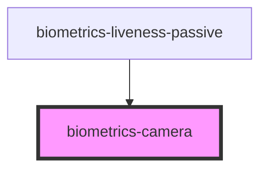

# biometrics-camera

<!-- Auto Generated Below -->

## Properties

| Property           | Attribute            | Description | Type                                           | Default         |
| ------------------ | -------------------- | ----------- | ---------------------------------------------- | --------------- |
| `facingMode`       | `facing-mode`        |             | `"environment" \| "left" \| "right" \| "user"` | `'environment'` |
| `maxPictureHeight` | `max-picture-height` |             | `number`                                       | `720`           |
| `maxPictureWidth`  | `max-picture-width`  |             | `number`                                       | `1280`          |

## Events

| Event             | Description | Type               |
| ----------------- | ----------- | ------------------ |
| `pictureCaptured` |             | `CustomEvent<any>` |

## Dependencies

### Used by

 - [biometrics-liveness-passive](../liveness_passive)

### Graph

----------------------------------------------

*Built with [StencilJS](https://stenciljs.com/)*
