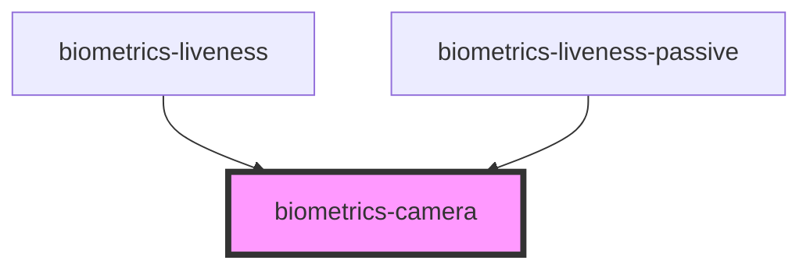

# biometrics-camera

<!-- Auto Generated Below -->

## Properties

| Property           | Attribute            | Description | Type                                           | Default         |
| ------------------ | -------------------- | ----------- | ---------------------------------------------- | --------------- |
| `facingMode`       | `facing-mode`        |             | `"environment" \| "left" \| "right" \| "user"` | `'environment'` |
| `maxPictureHeight` | `max-picture-height` |             | `number`                                       | `720`           |
| `maxPictureWidth`  | `max-picture-width`  |             | `number`                                       | `1280`          |
| `showControls`     | `show-controls`      |             | `boolean`                                      | `true`          |
| `type`             | `type`               |             | `"classic" \| "fullscreen"`                    | `'classic'`     |

## Events

| Event             | Description | Type               |
| ----------------- | ----------- | ------------------ |
| `pictureCaptured` |             | `CustomEvent<any>` |

## Methods

### `capture() => Promise<void>`

#### Returns

Type: `Promise<void>`

### `getSnapshot(maxWidth: number, maxHeight: number) => Promise<Blob>`

#### Returns

Type: `Promise<Blob>`

### `getSnapshotImageData(maxWidth: number, maxHeight: number) => Promise<ImageData>`

#### Returns

Type: `Promise<ImageData>`

### `getSnapshotUrl(maxWidth: number, maxHeight: number, type?: string) => Promise<string>`

#### Returns

Type: `Promise<string>`

## Dependencies

### Used by

 - [biometrics-liveness](../liveness)
 - [biometrics-liveness-passive](../liveness_passive)

### Graph

----------------------------------------------

*Built with [StencilJS](https://stenciljs.com/)*
