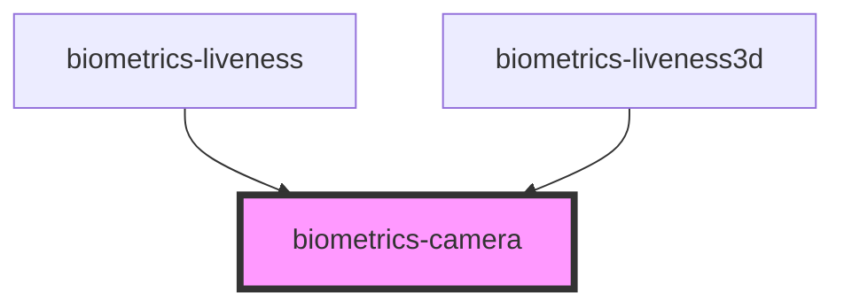

# biometrics-camera

<!-- Auto Generated Below -->

## Properties

| Property            | Attribute             | Description | Type                                           | Default         |
| ------------------- | --------------------- | ----------- | ---------------------------------------------- | --------------- |
| `buttonStyle`       | `button-style`        |             | `"classic" \| "normal"`                        | `'normal'`      |
| `facingMode`        | `facing-mode`         |             | `"environment" \| "left" \| "right" \| "user"` | `'environment'` |
| `fullScreen`        | `full-screen`         |             | `boolean`                                      | `true`          |
| `maxPictureHeight`  | `max-picture-height`  |             | `number`                                       | `1280`          |
| `maxPictureWidth`   | `max-picture-width`   |             | `number`                                       | `1280`          |
| `showCaptureButton` | `show-capture-button` |             | `boolean`                                      | `true`          |
| `showConfirmButton` | `show-confirm-button` |             | `boolean`                                      | `true`          |

## Events

| Event             | Description | Type               |
| ----------------- | ----------- | ------------------ |
| `pictureCaptured` |             | `CustomEvent<any>` |

## Methods

### `capture() => Promise<void>`

#### Returns

Type: `Promise<void>`

### `getSnapshot(maxWidth: number, maxHeight: number, type?: string, quality?: number) => Promise<Blob>`

#### Returns

Type: `Promise<Blob>`

### `getSnapshotImageData(maxWidth: number, maxHeight: number) => Promise<ImageData>`

#### Returns

Type: `Promise<ImageData>`

### `getSnapshotUrl(maxWidth: number, maxHeight: number, type?: string) => Promise<string>`

#### Returns

Type: `Promise<string>`

## Dependencies

### Used by

 - [biometrics-liveness](../liveness)
 - [biometrics-liveness3d](../liveness3d)

### Graph

----------------------------------------------

*Built with [StencilJS](https://stenciljs.com/)*
