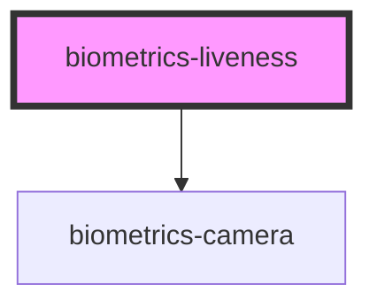

# biometrics-liveness

<!-- Auto Generated Below -->

## Properties

| Property           | Attribute            | Description | Type       | Default                                                                                                      |
| ------------------ | -------------------- | ----------- | ---------- | ------------------------------------------------------------------------------------------------------------ |
| `apiKey`           | `api-key`            |             | `string`   | `undefined`                                                                                                  |
| `autoStart`        | `auto-start`         |             | `boolean`  | `true`                                                                                                       |
| `instructions`     | --                   |             | `string[]` | `[ this.FRONTAL_FACE_INSTRUCTION, this.LEFT_PROFILE_FACE_INSTRUCTION, this.RIGHT_PROFILE_FACE_INSTRUCTION ]` |
| `maxInstructions`  | `max-instructions`   |             | `number`   | `5`                                                                                                          |
| `maxPictureHeight` | `max-picture-height` |             | `number`   | `600`                                                                                                        |
| `maxPictureWidth`  | `max-picture-width`  |             | `number`   | `720`                                                                                                        |
| `messages`         | `messages`           |             | `any`      | `{}`                                                                                                         |
| `serverUrl`        | `server-url`         |             | `string`   | `undefined`                                                                                                  |
| `showInitButton`   | `show-init-button`   |             | `boolean`  | `true`                                                                                                       |
| `timeout`          | `timeout`            |             | `number`   | `10`                                                                                                         |

## Events

| Event             | Description | Type               |
| ----------------- | ----------- | ------------------ |
| `sessionEnded`    |             | `CustomEvent<any>` |
| `sessionFailed`   |             | `CustomEvent<any>` |
| `sessionStarted`  |             | `CustomEvent<any>` |
| `sessionSucceded` |             | `CustomEvent<any>` |

## Methods

### `startSession() => Promise<void>`

#### Returns

Type: `Promise<void>`

### `stopSession() => Promise<void>`

#### Returns

Type: `Promise<void>`

## Dependencies

### Depends on

- [biometrics-camera](../camera)

### Graph

----------------------------------------------

*Built with [StencilJS](https://stenciljs.com/)*
