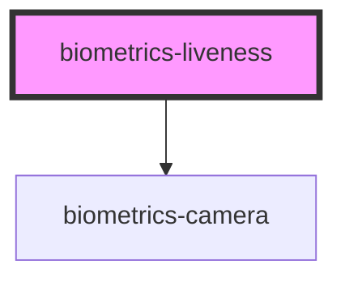

# biometrics-liveness

<!-- Auto Generated Below -->

## Properties

| Property                      | Attribute                        | Description | Type                                           | Default                                                                                                      |
| ----------------------------- | -------------------------------- | ----------- | ---------------------------------------------- | ------------------------------------------------------------------------------------------------------------ |
| `apiKey`                      | `api-key`                        |             | `string`                                       | `undefined`                                                                                                  |
| `autoStart`                   | `auto-start`                     |             | `boolean`                                      | `true`                                                                                                       |
| `cameraFacingMode`            | `camera-facing-mode`             |             | `"environment" \| "left" \| "right" \| "user"` | `'user'`                                                                                                     |
| `instructionPictureQuality`   | `instruction-picture-quality`    |             | `number`                                       | `0.75`                                                                                                       |
| `instructionTimeout`          | `instruction-timeout`            |             | `number`                                       | `10`                                                                                                         |
| `instructions`                | --                               |             | `string[]`                                     | `[ this.FRONTAL_FACE_INSTRUCTION, this.LEFT_PROFILE_FACE_INSTRUCTION, this.RIGHT_PROFILE_FACE_INSTRUCTION ]` |
| `maxInstructionPictureHeight` | `max-instruction-picture-height` |             | `number`                                       | `300`                                                                                                        |
| `maxInstructionPictureWidth`  | `max-instruction-picture-width`  |             | `number`                                       | `300`                                                                                                        |
| `maxInstructions`             | `max-instructions`               |             | `number`                                       | `5`                                                                                                          |
| `maxPictureHeight`            | `max-picture-height`             |             | `number`                                       | `600`                                                                                                        |
| `maxPictureWidth`             | `max-picture-width`              |             | `number`                                       | `720`                                                                                                        |
| `maxStatusFailBuffer`         | `max-status-fail-buffer`         |             | `number`                                       | `1`                                                                                                          |
| `messages`                    | `messages`                       |             | `any`                                          | `{}`                                                                                                         |
| `mode`                        | `mode`                           |             | `"classic" \| "mask"`                          | `'classic'`                                                                                                  |
| `pictureQuality`              | `picture-quality`                |             | `number`                                       | `0.95`                                                                                                       |
| `serverUrl`                   | `server-url`                     |             | `string`                                       | `undefined`                                                                                                  |
| `showInitButton`              | `show-init-button`               |             | `boolean`                                      | `true`                                                                                                       |
| `timeout`                     | `timeout`                        |             | `number`                                       | `45`                                                                                                         |

## Events

| Event             | Description | Type               |
| ----------------- | ----------- | ------------------ |
| `sessionFailed`   |             | `CustomEvent<any>` |
| `sessionStarted`  |             | `CustomEvent<any>` |
| `sessionSucceded` |             | `CustomEvent<any>` |

## Methods

### `startSession() => Promise<void>`

#### Returns

Type: `Promise<void>`

### `stopSession() => Promise<void>`

#### Returns

Type: `Promise<void>`

## Dependencies

### Depends on

- [biometrics-camera](../camera)

### Graph

----------------------------------------------

*Built with [StencilJS](https://stenciljs.com/)*
