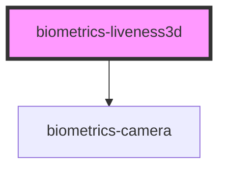

# biometrics-liveness_passive

<!-- Auto Generated Below -->

## Properties

| Property                | Attribute                 | Description | Type      | Default     |
| ----------------------- | ------------------------- | ----------- | --------- | ----------- |
| `apiKey`                | `api-key`                 |             | `string`  | `undefined` |
| `faceDetectionInterval` | `face-detection-interval` |             | `number`  | `200`       |
| `faceDetectionSeconds`  | `face-detection-seconds`  |             | `number`  | `2`         |
| `maxPictureHeight`      | `max-picture-height`      |             | `number`  | `1280`      |
| `maxPictureWidth`       | `max-picture-width`       |             | `number`  | `1280`      |
| `serverUrl`             | `server-url`              |             | `string`  | `undefined` |
| `showStartButton`       | `show-start-button`       |             | `boolean` | `true`      |
| `startOnInit`           | `start-on-init`           |             | `boolean` | `true`      |

## Dependencies

### Depends on

- [biometrics-camera](../camera)

### Graph

----------------------------------------------

*Built with [StencilJS](https://stenciljs.com/)*
