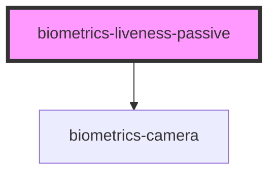

# biometrics-liveness_passive

<!-- Auto Generated Below -->

## Properties

| Property           | Attribute            | Description | Type     | Default     |
| ------------------ | -------------------- | ----------- | -------- | ----------- |
| `apiKey`           | `api-key`            |             | `string` | `undefined` |
| `maxPictureHeight` | `max-picture-height` |             | `number` | `600`       |
| `maxPictureWidth`  | `max-picture-width`  |             | `number` | `720`       |
| `serverUrl`        | `server-url`         |             | `string` | `undefined` |

## Events

| Event                          | Description | Type               |
| ------------------------------ | ----------- | ------------------ |
| `livenessVerificationComplete` |             | `CustomEvent<any>` |

## Dependencies

### Depends on

- [biometrics-camera](../camera)

### Graph

----------------------------------------------

*Built with [StencilJS](https://stenciljs.com/)*
