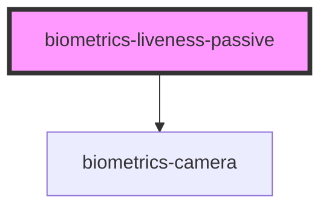

# biometrics-liveness_passive

<!-- Auto Generated Below -->

## Properties

| Property                | Attribute                 | Description | Type      | Default     |
| ----------------------- | ------------------------- | ----------- | --------- | ----------- |
| `apiKey`                | `api-key`                 |             | `string`  | `undefined` |
| `autoCapture`           | `auto-capture`            |             | `boolean` | `true`      |
| `autoCaptureTimeout`    | `auto-capture-timeout`    |             | `number`  | `3`         |
| `faceDetectionInterval` | `face-detection-interval` |             | `number`  | `200`       |
| `maxPictureHeight`      | `max-picture-height`      |             | `number`  | `600`       |
| `maxPictureWidth`       | `max-picture-width`       |             | `number`  | `720`       |
| `serverUrl`             | `server-url`              |             | `string`  | `undefined` |
| `useFaceDetector`       | `use-face-detector`       |             | `boolean` | `true`      |

## Events

| Event                          | Description | Type               |
| ------------------------------ | ----------- | ------------------ |
| `livenessVerificationComplete` |             | `CustomEvent<any>` |

## Dependencies

### Depends on

- [biometrics-camera](../camera)

### Graph

----------------------------------------------

*Built with [StencilJS](https://stenciljs.com/)*
